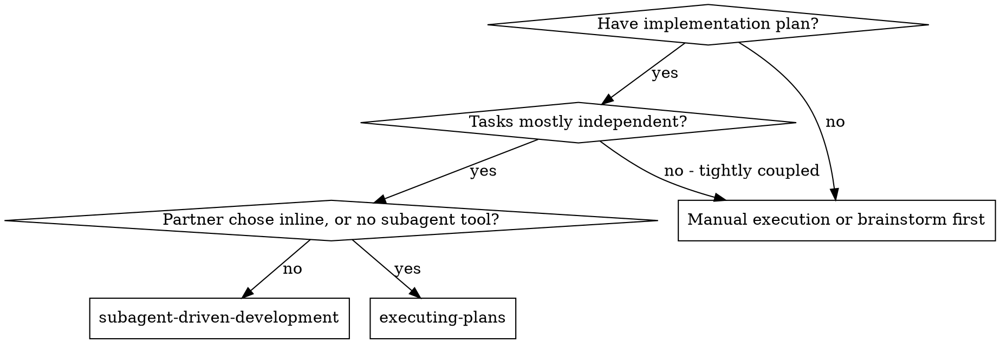
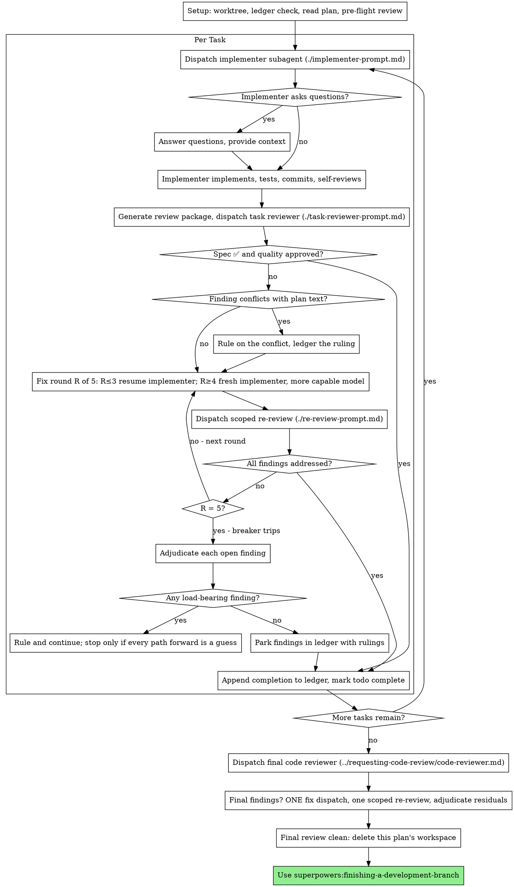

# Subagent-Driven Development

Execute plan by dispatching a fresh implementer subagent per task, a task review (spec compliance + code quality) after each, and a broad whole-branch review at the end.

**Why subagents:** You delegate tasks to specialized agents with isolated context. By precisely crafting their instructions and context, you ensure they stay focused and succeed at their task. They should never inherit your session's context or history — you construct exactly what they need. This also preserves your own context for coordination work.

**Core principle:** Fresh subagent per task + task review (spec + quality) + broad final review = high quality, fast iteration

**Narration:** between tool calls, narrate at most one short line — the
ledger and the tool results carry the record.

**Continuous execution:** Do not pause to check in with your human partner between tasks. Execute all tasks from the plan without stopping. The only reasons to stop are the four named below, or all tasks complete. "Should I continue?" prompts and progress summaries waste their time — they asked you to execute the plan, so execute it.

**Rulings, not stalls.** A running plan does not wait on a human. Conflicts,
ambiguities, plan defects, a cap you would have asked to exceed — decide
them. The spec is the binding authority, the plan is its argument, and your
judgment settles what neither answers. Record every decision in the ledger as
`Ruling: <what you decided> — <why> — <what it costs if wrong>`, and keep
going. A wrong ruling costs rework your human partner can see and undo; a
session parked on a question costs their whole day and buys nothing.

Four things stop you, and only these: an irreversible or destructive
operation; a security-sensitive action; a side effect outside this worktree
that norms say you ask about first (a merge, a push to a shared branch, a
publish); and a plan so broken that every path forward is a guess. For those,
stop and ask.

## When to Use

**vs. Executing Plans (inline):**
- Fresh subagent per task (no context pollution) instead of one context doing every task
- Review after each task (spec compliance + code quality) instead of only at the end
- Costs a fresh context per task and per review; inline costs one context plus one final reviewer
- Both run in this session, share the same plan workspace and ledger, and never pause between tasks

## The Process

## Setup

Ensure implementation occurs in an isolated git worktree (`superpowers:using-git-worktrees`). Never modify `main`/`master` without explicit consent.

- **Workspace per plan:** Initialize via `bash scripts/sdd-workspace PLAN_FILE` (stores ledger, briefs, and packages).
- **Progress Ledger:** Maintain `<workspace>/progress.md` with plan identity on line 1. Survives context compaction.
- **Pre-flight conflict scan:** Audit plan tasks for contradictions before dispatching Task 1.

See [references/TASK_EXECUTION_DETAILS.md](references/TASK_EXECUTION_DETAILS.md) for ledger schema and recovery rules.

## Model Selection

Use the least powerful model capable of each role to conserve cost and latency:
- **Mechanical tasks (1-2 files, explicit specs):** fast/cheap model.
- **Integration & judgment tasks (multi-file, pattern matching):** standard model.
- **Architecture & whole-branch review:** most capable available model.
- **Fix escalation (rounds 4-5):** bump model tier above the stuck implementer.
- **Explicit specification:** Always explicitly declare the model on dispatch.

See [references/TASK_EXECUTION_DETAILS.md](references/TASK_EXECUTION_DETAILS.md) for full complexity signals and turn-count optimization.

## The Task Loop

**Batch small same-shape work.** When the plan lists several tasks that are
each a small, independent edit of the same kind — the same one-line fix,
constant change, or field addition repeated across files — do not dispatch
one subagent per task. Compose ONE dispatch brief listing every file and
its change, send the whole batch to a single subagent, and review its diff
as one unit. Reserve one-dispatch-per-task for work that needs its own
judgment, its own tests, or its own review surface.

Everything you paste into a dispatch prompt — and everything a subagent
prints back — stays resident in your context for the rest of the session
and is re-read on every later turn. Hand artifacts over as files.

**Waiting on dispatched subagents:** never poll a wait interface with
short timeouts, and never sit in one silent, open-ended wait either.
While you have local work — ledger updates, packaging the next review,
reading reports — keep working; child results arrive on their own.
When you are genuinely idle, wait in bounded stretches (five to ten
minutes, where your platform allows), and between stretches post one
line of status and reconcile your live children: list them, and chase
any that finished without reporting. A bounded stretch keeps nearly
all of a long wait's efficiency while guaranteeing a stuck or lost
child is noticed within minutes, not at the end of the session.

### 1. Dispatch the implementer

Record BASE (`git rev-parse HEAD`) before dispatching.
- **Task brief:** Run `bash scripts/task-brief PLAN_FILE N` to extract requirements to an isolated file.
- **Report file:** Specify report path (`.../task-N-report.md`) where implementer outputs status, commits, and test proofs.
- **Context hygiene:** Include only the brief, touchpoints, and global constraints—never paste past session transcripts.
- **No recursive subagents:** Implementers do not dispatch child agents or reviewers.

Template: [implementer-prompt.md](implementer-prompt.md)
See [references/TASK_EXECUTION_DETAILS.md](references/TASK_EXECUTION_DETAILS.md) for dispatch protocols.

### 2. Handle the report

Handle implementer report status according to rubric:
- **DONE:** Generate review package (`bash scripts/review-package PLAN_FILE BASE HEAD`) and dispatch task reviewer.
- **DONE_WITH_CONCERNS:** Evaluate correctness/scope concerns before dispatching review.
- **NEEDS_CONTEXT:** Provide missing context and re-dispatch.
- **BLOCKED:** Assess cause (missing context, model reasoning ceiling, task sizing, or plan defect). Escalate model if reasoning ceiling reached; ledger plan rulings.

See [references/TASK_EXECUTION_DETAILS.md](references/TASK_EXECUTION_DETAILS.md) for full blocker escalation flows.

### 3. Review the task

Per-task reviews are task-scoped gates. The broad review happens once, at the
final whole-branch review. Never skip the task review, and never accept a
report missing either verdict — spec compliance AND task quality are both
required. Implementer self-review never replaces the task review; both are
needed.

- Generate review package via `bash scripts/review-package PLAN_FILE BASE HEAD` and pass the printed path to the reviewer subagent.
- Provide the brief path, report path, and verbatim global constraints.
- Task review requires both verdicts: spec compliance AND code quality.
- For detailed reviewer directives, handling unverified diffs, and prompt template parameters, see [references/TASK_EXECUTION_DETAILS.md](references/TASK_EXECUTION_DETAILS.md).

Template: [task-reviewer-prompt.md](task-reviewer-prompt.md)

### 4. The fix loop

Triggers on spec ❌, Critical/Important findings, or verified gaps. Up to 5 rounds maximum:
- **Minor findings:** Record in progress ledger as deferred; do not loop on minors.
- **Rounds 1-3:** Resume the original implementer with verbatim open findings.
- **Rounds 4-5:** Dispatch fresh implementer on a more capable model with prior attempt history.
- **Scoped re-review:** Generate diff package (`bash scripts/review-package PLAN_FILE FIX_BASE HEAD`) and dispatch [re-review-prompt.md](re-review-prompt.md).
- **Circuit Breaker (Round 5):** If findings remain after round 5, adjudicate: park non-blocking items with ruling; rule on load-bearing items. Never discard silently.

Template: [re-review-prompt.md](re-review-prompt.md)
See [references/TASK_EXECUTION_DETAILS.md](references/TASK_EXECUTION_DETAILS.md) for complete fix loop and adjudication procedures.

### 5. Complete the task

When the review comes back clean — or every open finding is parked with a
ruling at the cap — append the completion line to the ledger in the same
message as your other bookkeeping:

- `Task <N>: complete (commits <base7>..<head7>, review clean)`
- `Task <N>: complete (commits <base7>..<head7>, <K> parked)` after a
  tripped breaker

Then mark the todo complete and move on. Never move to the next task while
the review has open Critical/Important issues that are neither fixed nor
parked-with-ruling at the cap.

## Final Review

The final whole-branch review gets a package too: run
`bash scripts/review-package PLAN_FILE MERGE_BASE HEAD` (MERGE_BASE = the commit the
branch started from, e.g. `git merge-base main HEAD`) and include the
printed path in the final review dispatch, so the final reviewer reads
one file instead of re-deriving the branch diff with git commands. Dispatch
on the most capable available model (see Model Selection), using
superpowers:requesting-code-review's
[code-reviewer.md](../requesting-code-review/code-reviewer.md). Point it at
the ledger's deferred-minor and parked lines so it can triage which must be
fixed before merge.

If the final whole-branch review returns findings, dispatch ONE fix subagent
with the complete findings list — not one fixer per finding.
Per-finding fixers each rebuild context and re-run suites; a real
session's final-review fix wave cost more than all its tasks combined.
Then run exactly one scoped re-review of the fix wave
(`bash scripts/review-package PLAN_FILE FIX_BASE HEAD` over the fix range,
[re-review-prompt.md](re-review-prompt.md)).
Adjudicate any residual findings as in the task loop's breaker: park with
rulings, or rule on the load-bearing ones and ledger what you decided. Only
the four classes above stop you here. There is no second fix wave —
residual load-bearing findings surface to your human partner when
finishing-a-development-branch presents the options.

## Finish

Before you delete anything, collect every ledger line containing `Ruling:` —
preflight rulings, parked findings, breaker adjudications, all of them — into
your final message under "Rulings I made", in the order you made them, each
with what it costs if wrong. The list is exhaustive: if the ledger holds a
ruling, the list holds it. That list is the only place the decisions you
took on your human partner's behalf reach them — they read it and rework
whatever you got wrong. A ruling that dies with the workspace was a decision
made in secret.

When the final whole-branch review is clean and its fixes are merged,
delete this plan's workspace (`rm -rf <workspace>`) — the git history is
the record now. Sibling directories belong to other plans; leave them
alone.

Use superpowers:finishing-a-development-branch.

## Common Rationalizations

| Excuse | Reality |
|--------|---------|
| "Close enough on spec compliance" | Reviewer found spec gaps = not done. Fix or hit the cap and adjudicate — those are the only exits. |
| "I'll fix it myself, dispatching is overhead" | Controller fixes pollute your context and skip review. Resume the implementer. |
| "One more round will converge" | Past the cap, rounds don't converge — the failure is structural. Adjudicate and route. |
| "The reviewer will just find something new anyway" | Scoped re-reviews verify fixes; they cannot wander. New findings on untouched code go to the ledger, not the loop. |
| "This finding is obviously wrong, I'll drop it" | You adjudicate only at the cap, and every ruling is a ledger entry. Silent discards are forbidden. |
| "The fix was small, skip the re-review" | Unreviewed fixes are how regressions land. Every round ends with a scoped re-review. |
| "Reviews slow the loop down" | The loop without reviews is just unverified churn. Reviews are the loop's brakes and steering. |
| "Ledger bookkeeping is overhead" | The ledger is what survives compaction. Controllers without one have re-dispatched entire completed task sequences. |
| "The implementer spawned its own reviewer — free extra assurance" | It's a duplicate seat reviewing the same diff; the task review is the gate. A worker-spawned reviewer is a defect to flag, not rigor. |

## Example Workflow

See [references/EXAMPLE_WORKFLOW.md](references/EXAMPLE_WORKFLOW.md) for a complete annotated execution trace walkthrough.

